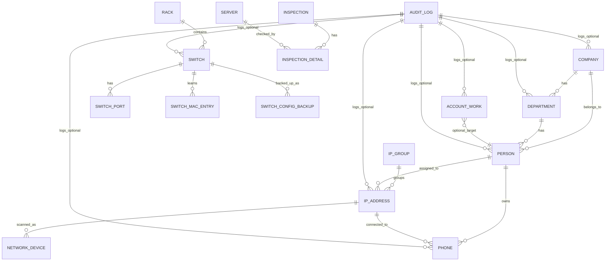
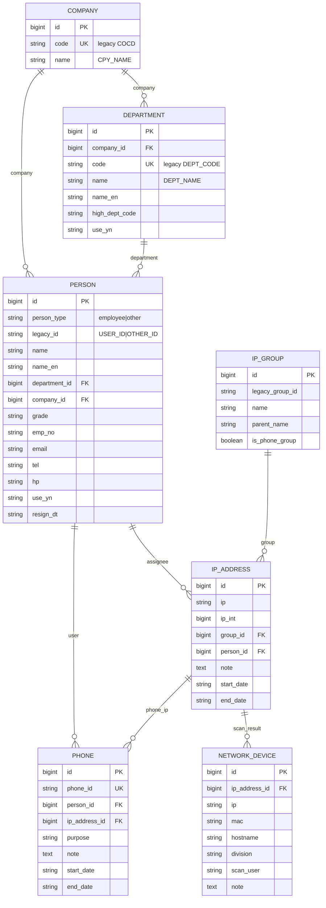
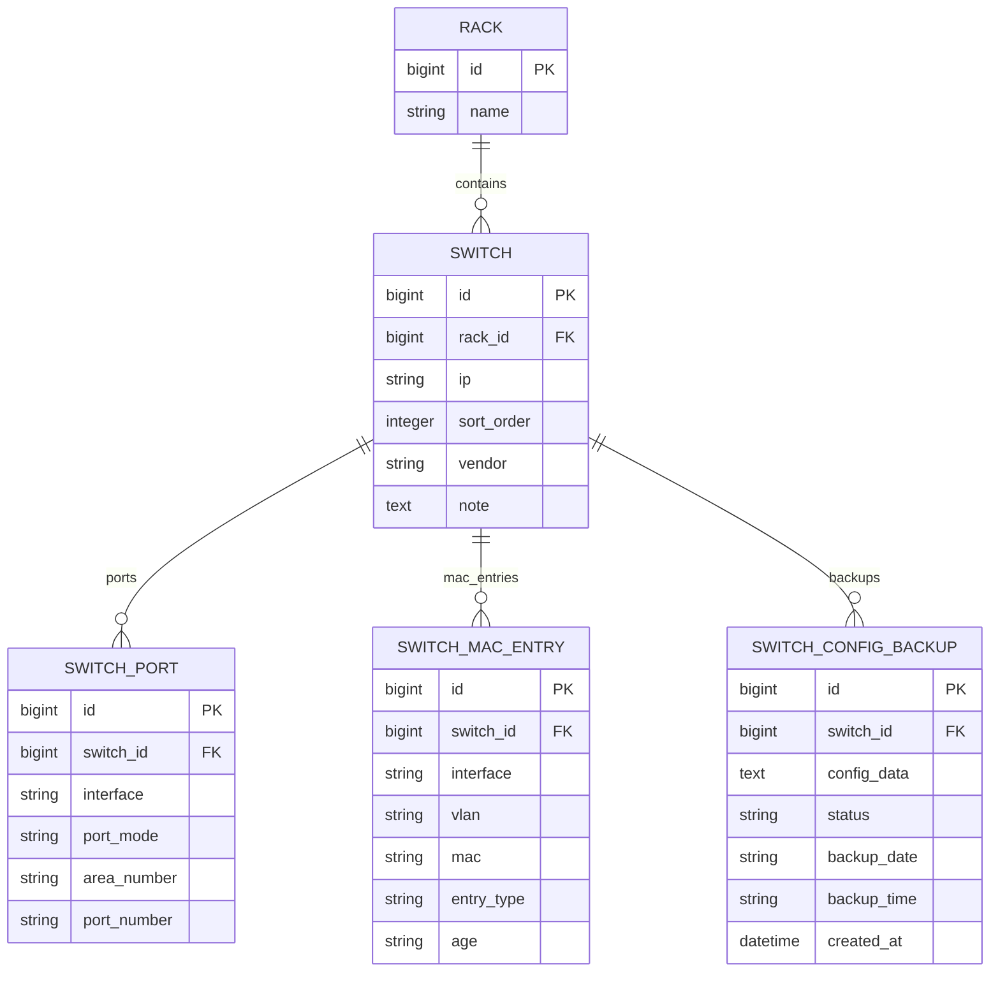
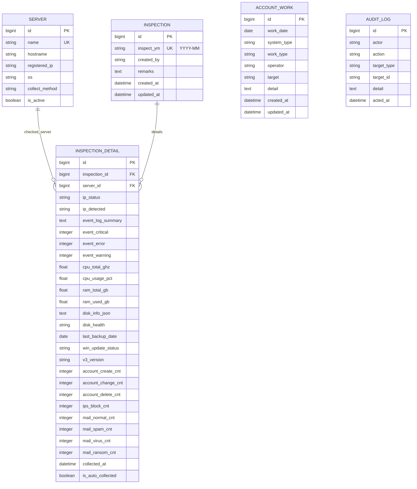

# Database ERD — 사내 IT 통합 관리 시스템

이 문서는 `system_requirements.md`, `legacy_system_analysis.md`, `feature_migration_map.md`, `ui_design_guide.md`를 기준으로 작성한 신규 시스템의 논리 ERD입니다.

기준 원칙:

- 기존 코드는 재사용하지 않는다.
- 기존 MariaDB 데이터는 신규 DB로 이전한다.
- 신규 DB 테이블은 Django `managed = True` 모델로 관리한다.
- 기존 테이블명은 migration source로만 사용하고, 신규 모델은 의미 있는 이름을 사용한다.
- 실제 구현 시 필드명/타입은 Django migration 과정에서 조정될 수 있다.

---

## 1. 전체 ERD

주의:

- `AUDIT_LOG`는 실제 FK를 강제하기보다 `target_type`, `target_id` 기반의 범용 감사 로그로 설계한다.
- `ACCOUNT_WORK.target`은 문서상 문자열 입력이 기본이며, 대상자가 내부 사용자일 경우 `Person`과 선택적으로 연결할 수 있다.
- Mermaid ERD에서 `AUDIT_LOG ||--o{ ...` 관계는 “로그 대상이 될 수 있음”을 표현한 논리 관계다.

---

## 2. 자산/조직 도메인 ERD

---

## 3. 스위치 도메인 ERD

권장 제약:

- `SwitchPort`: `(switch_id, interface)` unique 권장
- `SwitchMacEntry`: `mac`, `interface`, `switch_id` index 권장
- `SwitchConfigBackup`: `(switch_id, backup_date, backup_time)` index 권장

---

## 4. 정기점검/계정작업/감사 도메인 ERD

권장 제약:

- `Inspection.inspect_ym`: unique
- `InspectionDetail`: `(inspection_id, server_id)` unique
- `AccountWork`: `work_date`, `system_type`, `work_type`, `operator`, `target` index 권장
- `AuditLog`: `acted_at`, `actor`, `target_type`, `target_id`, `action` index 권장

---

## 5. 기존 테이블 → 신규 모델 매핑

| 기존 테이블 | 신규 모델 | 비고 |
|---|---|---|
| `CPY_INF` | `Company` | 회사 |
| `DPT_INF` | `Department` | 부서 |
| `USR_INF` | `Person` | `person_type='employee'` |
| `OTH_INF` | `Person` | `person_type='other'` |
| `IP_GRP_INF` | `IpGroup` | IP 그룹 |
| `IP_PRN_INF` | `IpGroup.parent_name` | 상위 그룹명 평탄화 |
| `GRP_INF` | `IpGroup` | 전화기 IP 그룹, `is_phone_group=True` |
| `IP_MNG` | `IpAddress` | IP 할당 정보 |
| `NTWR_DVCS_INF` | `NetworkDevice` | IPScan/장비 정보 |
| `PHN_MNG` | `Phone` | 내선/전화번호 |
| `RCK_INF` | `Rack` | 렉 |
| `SWT_INF` | `Switch` | 스위치 |
| `SWT_PRT_MD_INF` | `SwitchPort` | 포트 모드 |
| `PRT_CNC_LCT_INF` | `SwitchPort` | 포트 위치 통합 |
| `ETH_SWT_INF` | `SwitchMacEntry` | MAC/VLAN 학습 정보 |
| `SWT_CNF_BCK` | `SwitchConfigBackup` | 설정 백업 본문 |
| `SWT_BCK_INF` | `SwitchConfigBackup` | 백업 날짜/시간 통합 |
| `CHANGE_LOG` | `AuditLog` | 신규 감사 로그 구조로 재설계 |

---

## 6. 구현 시 확인할 사항

1. `Person.legacy_id`는 기존 `USER_ID`와 `OTHER_ID`가 같은 값으로 충돌할 수 있으므로 `person_type + legacy_id` unique를 권장한다.
2. `IpAddress.ip`와 `IpAddress.ip_int`는 모두 보존한다. 조회는 IP 문자열, 정렬은 `ip_int`를 사용한다.
3. 전화번호 삭제는 실제 row 삭제와 할당 해제를 구분한다.
4. IP 삭제도 실제 row 삭제와 할당 해제를 구분한다.
5. 스위치 포트는 `SWT_PRT_MD_INF`와 `PRT_CNC_LCT_INF`를 `switch_id + interface` 기준으로 병합한다.
6. 스위치 백업은 `SWT_CNF_BCK`와 `SWT_BCK_INF`를 `backup_id` 기준으로 병합한다.
7. 모든 데이터 변경은 `AuditLog`에 기록한다.
8. 외부 연동 정보가 없더라도 migration command, switch command, data update command는 dry-run/mock 가능한 구조로 작성한다.
